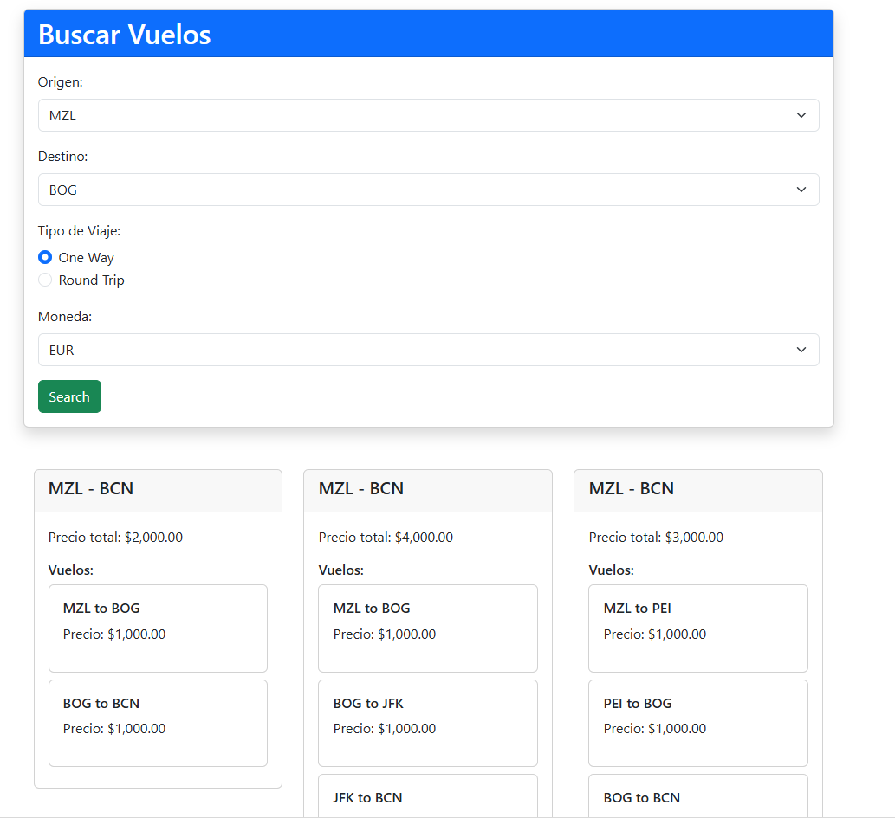

# dcx-air-tec-test
 technical test

* Angular 17.2
* Net 8.0

# Paradigms

> Transient singleton scoped design patterns
> dependency injection
> dapper
> linq notation
> SPA - single page application
> use of modules, components and services(Angular)
> Logs in aplication
> validators
> Mappers

# DataBase - SQLite (posibble SQRS)
MiDataBase.db

# arquitecture

> N layers
> DDD

# Layers
1. Presentation
2. Application
3. Domain
4. Infraestructure
5. Common

# double seeder possibility 

The possibility has been generated on the endpoint to load the seeder using two methods:

> standard from the json file in a specific location

> dynamic consuming the seeder api service

Project carried out in .net 8 with 5 layers focused on clean code and clean architectures, CQRS is not implemented due to time, however we have the knowledge to do it

# Plus 

> add collection used
> comments

# Evidence

I hope to improve this challenge and to be able to learn from each of the people who are on the other side by reviewing this document, a hug.

juan david calle